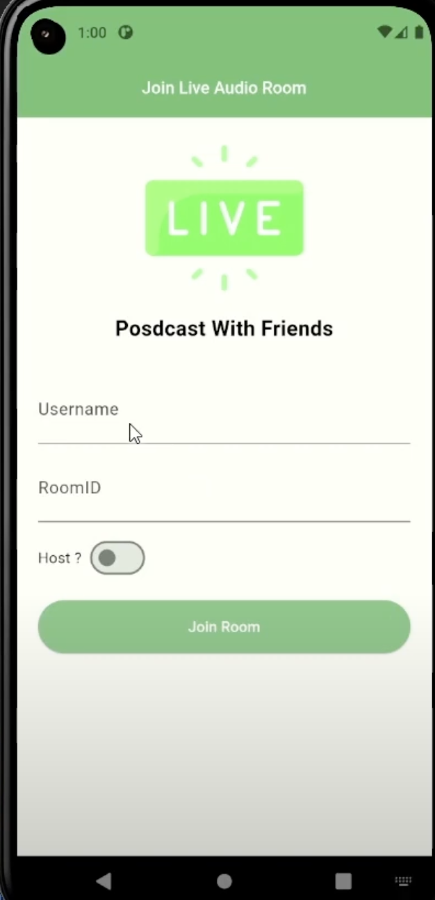
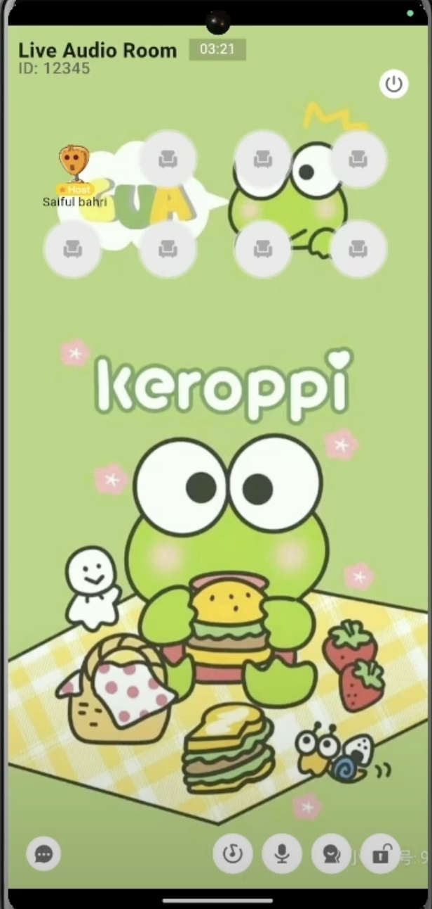

# Flutter Live Audio Room with Zegocloud SDK

Sample Live Audio Room with Flutter and Zegocloud SDK

* Get ZEGOCLOUD UIKits for 10,000 free mins: https://bit.ly/42f7qnC
* Take advantage of ZEGOCLOUD: https://bit.ly/48KnwbD
* How to build a live audio room: https://bit.ly/3vLANSG
* Product: https://www.zegocloud.com/uikits 
* Help resource: https://docs.zegocloud.com/article/15073 (flutter)

ZEGOCLOUD live audio room SDK allows you to easily build your live audio room apps with Flutter within minutes. 

## Youtube Link

https://youtu.be/JKYNlg7fM7s

## Playlist Flutter Intensive Club

https://www.youtube.com/playlist?list=PLQvQbJRJpIZ67MrVzPDOYtAs7wmFjmFUI (https://www.youtube.com/playlist?list=PLQvQbJRJpIZ67MrVzPDOYtAs7wmFjmFUI)

## ScreenShot

| Login         | Live Audio Room           |
|--------------|----------------|
|  |       |

## Contact:
* Linktree: https://linktr.ee/codewithbahri
* Youtube: https://youtube.com/@codewithbahri
* Github: https://github.com/bahrie127
* Linkedin: https://linkedin.com/in/bahrie
* Roadmap Flutter: https://youtu.be/e2zMJqDBmoY
* Medium: https://medium.com/@codewithbahri